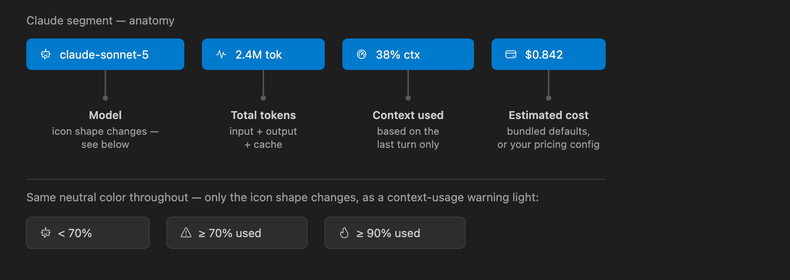
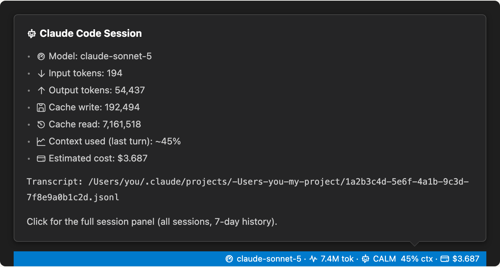
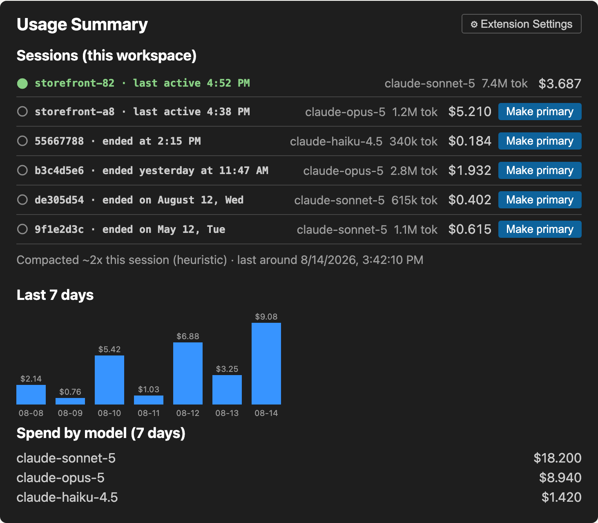

# Claude Simple Stats Bar (VS Code)

Live Claude Code session stats — model, tokens, context left, cost — in the VS Code status bar.


## Features

- Status bar segment with current model, total tokens, context used, and estimated cost, updating live as the transcript grows.
- Context usage shown as a `CALM`/`MED`/`WARN`/`CRIT` tag next to a matching icon (neutral below 50%, a small graph at ≥50%, a warning triangle at ≥70%, a flame at ≥90%), plus an optional 6-segment fill bar — turn the bar off with `claudeSimpleStatsBar.showContextBar` and keep just the icon, tag, and percentage.
- Hover tooltip with the full token breakdown (input / output / cache write / cache read) and the transcript path being tracked.
- Session panel with every session in the workspace, a 7-day spend chart, per-model spend, and a compaction count.
- Multi-session support — auto-detects every Claude Code transcript in the workspace, with a switchable primary.
- Configurable per-model pricing and adjustable poll interval.

## Requirements

- VS Code 1.90 or newer.
- The Claude Code CLI, writing transcripts locally under `~/.claude/projects/`. This extension has no other data source — see [Where the data comes from](#where-the-data-comes-from).

## Claude segment, explained



- **Model** — the active model name, led by a dashboard icon.
- **Total tokens** — input + output + cache for the whole session.
- **Context used** — the icon/tag/bar from Features above, based on the *last turn only*, not a running total. Answers "will my next message fit," not "how much have I used overall."
- **Estimated cost** — built-in pricing for the current Sonnet/Opus/Haiku/Fable lineup; override via `claudeSimpleStatsBar.pricing` (see [Cost estimates](#cost-estimates)).

Hover the segment for a per-category token breakdown and the transcript path:



## Session panel

Click the segment, or run **Claude Simple Stats Bar: Open Session Panel**:



1. **Sessions in this workspace** — every transcript found here, with the primary one marked. Each row shows a timestamp to tell sessions apart: `last active <time>` for a still-running session, or a scaled `ended <time>` for one that's finished. Running more than one session at once? Use **Make primary**, or the **Switch Primary Session** command, to pick a different one — the pick persists across VS Code restarts.
2. **Last 7 days** — a spend chart and per-model breakdown, stored locally and pruned past 7 days.
3. **Compaction** — a heuristic count of likely compaction events.

## Settings

| Setting | Default | What it does |
|---|---|---|
| `claudeSimpleStatsBar.pollIntervalMs` | `2000` | How often to re-check the transcript file, alongside the file watcher. |
| `claudeSimpleStatsBar.contextWindowTokens` | `0` | Override the context window size used for context % and compaction detection. `0` auto-detects from the model (1,000,000 for Sonnet/Opus/Fable, 200,000 for Haiku 4.5). |
| `claudeSimpleStatsBar.showContextBar` | `true` | Show the 6-segment fill bar next to the context-usage tag. Turn off to keep just the icon, tag, and percentage. |
| `claudeSimpleStatsBar.pricing` | `{}` | Per-model USD rates per 1M tokens; overrides or extends the built-in defaults. See [Cost estimates](#cost-estimates). |

## Commands

| Command | What it does |
|---|---|
| `Claude Simple Stats Bar: Refresh` | Force a re-read of the current transcript. |
| `Claude Simple Stats Bar: Open Session Panel` | Open the webview panel (also bound to clicking the Claude segment). |
| `Claude Simple Stats Bar: Switch Primary Session` | Pick which concurrent session in this workspace is tracked as primary. |

## Where the data comes from

There's no public API for Claude Code session telemetry. This extension reads the same `.jsonl` transcript files Claude Code already writes to disk, under `~/.claude/projects/<workspace-path-with-slashes-replaced-by-dashes>/<session-id>.jsonl`. It scans every folder in a (possibly multi-root) workspace for a matching directory and picks the most recently modified file as primary, re-parsing it on file changes plus a periodic poll as a fallback.

This is reverse-engineered from observed transcript files, not a documented format. If Claude Code changes it, `src/claudeSession/transcriptLocator.ts` and `src/claudeSession/transcriptParser.ts` are where to look.

## Cost estimates

Built-in USD rates ship for the current Sonnet/Opus/Haiku/Fable lineup (as of 2026-08), so cost shows without any setup. Anthropic's pricing changes over time — verify current rates before relying on this for anything beyond a rough estimate. Override a model's rate, or add one that isn't built in, via `claudeSimpleStatsBar.pricing`:

```json
{
  "claudeSimpleStatsBar.pricing": {
    "claude-sonnet-5": {
      "inputPerMillion": 3,
      "outputPerMillion": 15,
      "cacheWritePerMillion": 3.75,
      "cacheReadPerMillion": 0.3
    }
  }
}
```

Models with neither a built-in default nor a configured entry show cost as `n/a`.

## Install

Not on the Marketplace yet. To run it locally:

**Try it without installing anything:**

1. Clone the repo and open the folder in VS Code: `git clone https://github.com/rcanpahali/claude-simple-stats-bar.git`
2. Press `F5` — this compiles the extension and opens an Extension Development Host window with it loaded.
3. Open any folder in that new window; the Claude segment appears bottom-right.

**Install it into your real VS Code:**

```bash
git clone https://github.com/rcanpahali/claude-simple-stats-bar.git
cd claude-simple-stats-bar
npm install
npm run compile
npx @vscode/vsce package
code --install-extension claude-simple-stats-bar-0.3.0.vsix
```

Then reload the window (`Cmd+Shift+P` → "Developer: Reload Window"). After code changes, repeat the last two commands to update it.

## Changelog

See [CHANGELOG.md](CHANGELOG.md).
